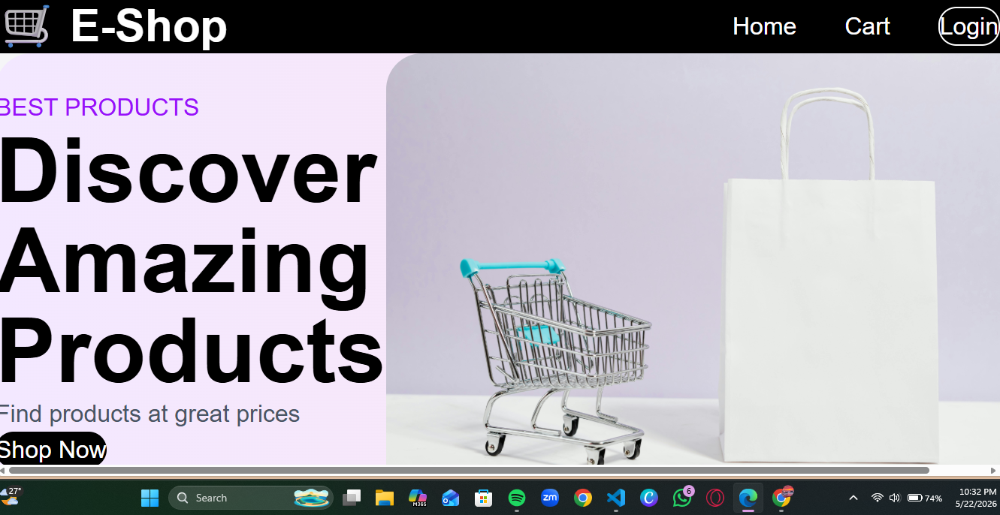

# 🛒 Ecommerce-App

A full-stack E-Commerce Web Application built using React, Node.js, Express, MongoDB, and Tailwind CSS.

This application allows users to browse products, add items to cart, authenticate securely, and manage orders with role-based access.

---

## 🚀 Features

### 👤 User Features
- User Registration & Login
- JWT Authentication
- Browse Product Catalog
- Add Products to Cart
- Checkout Flow
- Responsive UI

### 🛠 Admin Features
- Product Management
- Order Management
- Role-Based Access Control

---

## 🧰 Tech Stack

### Frontend
- React
- React Router
- Axios
- Tailwind CSS

### Backend
- Node.js
- Express.js
- JWT Authentication

### Database
- MongoDB
- Mongoose

---

## 📁 Project Structure

```bash
Ecommerce-App/
│
├── backend/
│   ├── config/
│   ├── controllers/
│   ├── middleware/
│   ├── models/
│   ├── routes/
│   ├── server.js
│   └── .env
│
├── frontend/
│   ├── src/
│   │   ├── components/
│   │   ├── pages/
│   │   ├── context/
│   │   ├── services/
│   │   ├── App.js
│   │   └── main.jsx
│
└── README.md
```

---

## ⚙️ Installation

### Clone Repository

```bash
git clone https://github.com/YOUR_USERNAME/Ecommerce-App.git
```

Move into project:

```bash
cd Ecommerce-App
```

---

## Backend Setup

```bash
cd backend
npm install
```

Create `.env`

```env
PORT=5000
MONGO_URI=your_mongodb_connection
JWT_SECRET=your_secret_key
```

Start backend:

```bash
npm run dev
```

---

## Frontend Setup

Open new terminal:

```bash
cd frontend
npm install
npm run dev
```

Frontend:

```text
http://localhost:5173
```

Backend:

```text
http://localhost:5000
```

---

## 📸 Screenshots
Home Page


```md

```

---

## 🔐 Environment Variables

Create:

```text
backend/.env
```

Required variables:

```env
PORT=
MONGO_URI=
JWT_SECRET=
```


---

## 🎯 Learning Outcomes

- Full Stack Development
- REST API Development
- Authentication & Authorization
- State Management
- Database Integration
- Responsive UI Design

---

## 🔮 Future Improvements

- Payment Gateway
- Product Search
- Product Reviews
- Wishlist
- Order Tracking
- Cloudinary Image Upload
- Deployment

---

## 👩‍💻 Author

Built by **Anet Colin Rockey**

GitHub:
https://github.com/AnetColin
